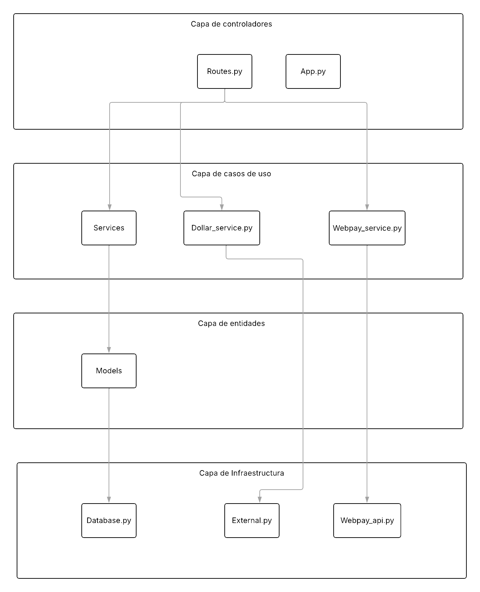

<h2>Ferramas </h2> 

<p><em>FERREMAS es una distribuidora chilena de productos de ferretería y construcción, fundada en los años 80 y con presencia en la Región Metropolitana y otras regiones del país. Ofrece una amplia gama de herramientas, materiales eléctricos, pinturas y equipos de seguridad, trabajando con marcas reconocidas como Bosch, Makita, Stanley y Sika.

Con una estructura organizativa definida (administradores, vendedores, bodegueros y contadores), FERREMAS ha evolucionado hacia un modelo híbrido de ventas físicas y en línea para facilitar el abastecimiento a ferreterías y constructoras. Este proyecto busca digitalizar y optimizar sus operaciones.
</em></p>


**Lenguajes y herramientas utilizadas:** 

<p>
  <a href="https://github.com/anmolpant/SaniText">
    
  </a>
  
  <code></code>
  <code></code>
  <code></code> 
</p>

<div align="center">


</div>


###  Diagrama de API


<p><em>
Este diagrama representa la estructura de nuestra API basada en los principios de Arquitectura Limpia. Cada capa tiene una responsabilidad específica, lo que favorece la mantenibilidad, escalabilidad y testeo del sistema. Las capas internas no dependen de las externas, y todo acceso a recursos como Transbank o la base de datos se realiza a través de los casos de uso, mediante adaptadores o servicios.
</em></p>


<p><strong>Controladores</strong> → Reciben las peticiones HTTP (por ejemplo, obtener productos o crear una transacción).</p>
<p><strong>Casos de Uso</strong> → Contienen la lógica de negocio (por ejemplo, <code>ProductService</code>, iniciar transacción con Transbank).</p>
<p><strong>Entidades</strong> → Representan los modelos del dominio (por ejemplo, <code>Product</code>, <code>Dollar</code>, <code>Subscription</code>).</p>
<p><strong>Infraestructura</strong> → Gestiona las conexiones externas (base de datos, servicios externos como Transbank).</p>

<p>Esta arquitectura separa claramente lo que el usuario ve, la lógica del negocio, los datos y las dependencias externas en capas independientes, facilitando la mantenibilidad y escalabilidad del sistema.</p>


```javascript
const anmol = {
    pronouns: "Bro" | "Bruh",
    code: ["Javascript", "HTML", "Python", "Java", "C++"],
    askMeAbout: ["Web Dev", "Tech", "Machine learning", "Software Development", "TV Shows", "Content Writing", "Memes"],
    technologies: {
        frontEnd: {
            js: ["Vanilla", "jQuery"],
            css: ["CSS3", "Tailwind", "Bootstrap"]
        },
        backEnd: {
            python: ["flask"]
            java : ["JSP"]
        },
        devOps: ["GCP"], ["Azure"]
        databases: ["Mongo", "MySql", "sqlite", "phpMyAdmin", "Oracle"],
        ML: ["Tensorflow", "Keras", "Sklearn", "open-cv", "matplotlib", "pandas", "Octave"]
    },
    currentProject: "Working on enhancing my current skillset whilst simultaneously looking for new opportunities.",
    funFact: "My jokes are a cry for help."
};
```


---


